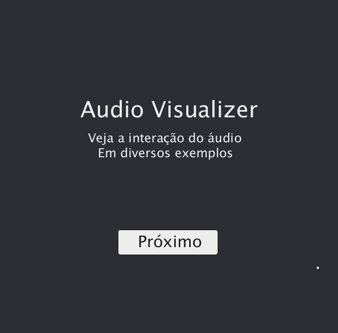
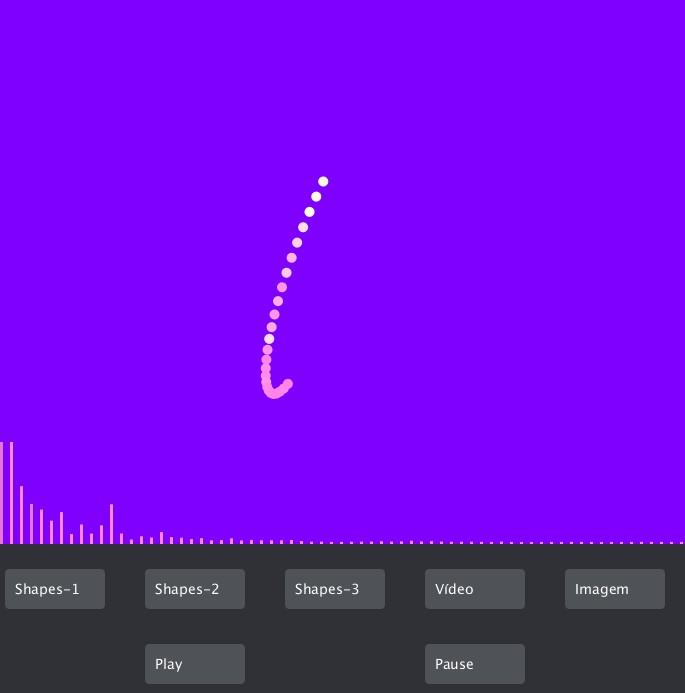

<h2>Sobre</h2>

O Audio Visualizer é inspirado em um windows media player antigo onde as imagens e shapes reagiam ao áudio dando uma efeito muito interessante.

Nosso Projeto contém diversos exemplos da reação de shapes, imagens e videos, com base no áudio de músicas.

<h2>Como abrir no seu computador</h2>
<ol>
  <li>
    
Primeiramente para baixar o projeto será necessario que você clone o repositório ou baixe um arquivo zip

  </li>
  <li>
    
Em seguida crie uma pasta com o nome MAIN e coloque todos os arquivos baixados nela

  </li>
  <li>
    
Depois desses passos você pode abrir o arquivo MAIN.pde e executar normalmente como um programa do processing

  </li>
</ol>

<h2>Tecnologias</h2>

<ul>
  <li>
    <a target="_new" href="http://code.compartmental.net/tools/minim/">Minim</a>
  </li>
  <li>
    <a target="_new" href="https://processing.org/reference/libraries/video/index.html">Processing Video</a>
  </li>
  <li>
    <a target="_new" href="https://processing.org/reference/libraries/sound/">Processing Sound</a>
  </li>
  <li>
    <a target="_new" href="https://processing.org/tutorials/p3d/">Processing P3D</a>
  </li>
</ul>

<h2>Criadores</h2>

<ul>
  <li>
    <a target="_new" href="https://github.com/LeonardoLuize">Leonardo Luize</a>
  </li>
  <li>
    <a target="_new" href="https://github.com/Kovalski-rgb">André Kovalski</a>
  </li>
  <li>
    
Pedro Henrique Mess Dubberstein Oviedo Ferreira

  </li>
  <li>
    
Mikael Da Silva Sirqueira

  </li>
  <li>
    
Rodrigo Alves Bolincenha

  </li>
</ul>
